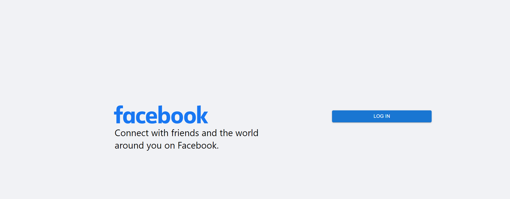
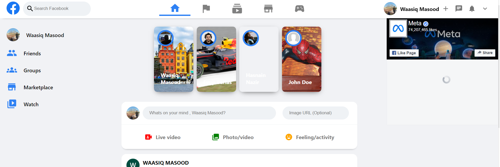
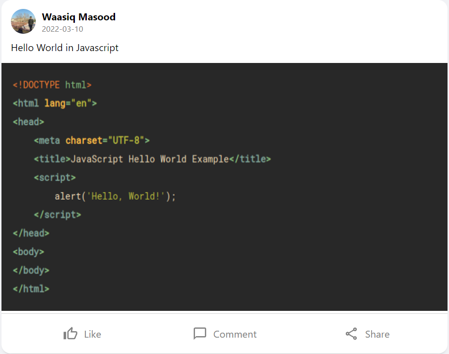

# Facebook clone

A facebook clone which uses Firebase authentication to login using your Google account. 
Clone was made for learning purposes, the project can be forked or the code be downloaded to run it on local environment. 

This project was bootstrapped with [Create React App](https://github.com/facebook/create-react-app).

## Tech used:
- ReactJs
- Context API
- HTML/CSS/JSX
- ES6 JavaScript
- Firebase Google Authentication
- Firestore Database
- Firebase Hosting


### Future Plans:
- Implement messenger function using SocketIO.
- Code the specific user page and implement React Router DOM


### Running the application
Runs the app in the development mode using ```npm start```.
Open [localhost:3000](localhost:3000) to view it in your browser.

Alternatively the application has also been hosted online on the following link: [Facebook Clone](https://fb-clone-3529f.web.app/)

*About Firebase hosting:* The firebase hosting site tells you that the website might be dangerous as
it is a clone website so the system detects it as a threat. Alternatively I started the Firestore DB in test mode so it might be down after 30 days. Shoot me up a message on LinkedIn and I'll try to fix in case of errors.


### Screenshots




